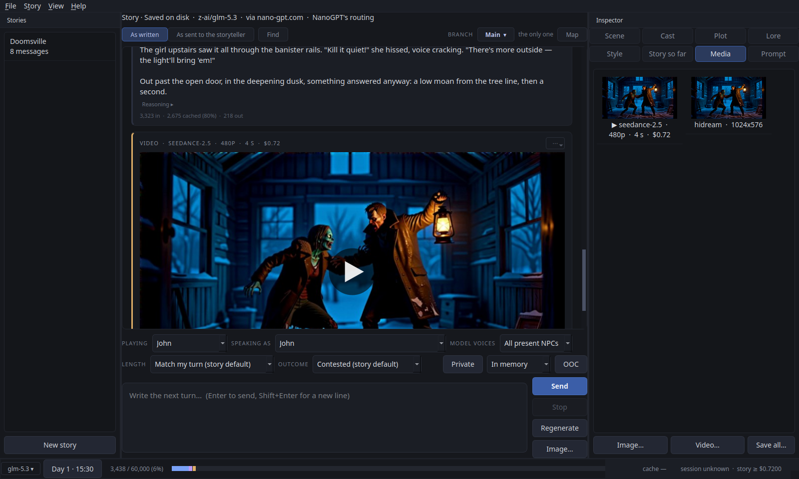

# SealedLore

A Linux and Windows application for AI-driven roleplay with many characters
in an open world, with a number of particularly useful features.



*Beta.* This application has been tested extensively both through
automation and manually by the developer. It is however still in early
public testing, so expect bugs, and there are no guarantees that everything
works as intended. Bug reports and pull requests are welcome; see
[CONTRIBUTING.md](CONTRIBUTING.md). Free software under the AGPL (see
[Licence](#licence)).

### Privacy

The "Sealed" in the name refers both to the plots (see below) and to how the
application handles your chats. It fully supports NanoGPT's end-to-end
encrypted private models, as well as their standard TEE models and local
servers. But that alone isn't that special.

What makes it more useful is that you can switch from your usual model to a
private one seamlessly, mid-story, and nothing from the private part reaches
your usual model except a summary you approve.

Let's say you're using Claude Sonnet for your roleplay, as it is one of the
best models for prose. Then your story goes somewhere Sonnet may not handle,
or somewhere you simply want to keep private. At that point you can start a
private scene on an end-to-end encrypted model like GLM 5.3. The private
model picks up the story where it is (if the story is too long for it, your
usual model can first condense it into a summary), and you carry on with the
private model. When you are done, you end the private scene: the private
model summarises it, keeping anything intimate or sensitive vague and safe
for work, and shows you the summary. You can drop it, change it or approve
it, and the approved summary is added to your main story. You then continue
with the smarter model, and all it knows of that part are the key plot
points, without the material that might cause refusals.

A simple chat can do the same: the Private button holds the next part of the
conversation on your private model, and the chat's own model reads only the
summary you approve.

### Author-driven plots

The "Sealed" in the name also refers to plots written by a person (or, I
suppose, an AI) and kept hidden from the player as they play through them.
Events can trigger under specific circumstances, or at specific times in the
story.

So rather than an AI simply injecting random events to spice up a story, an
actual human can write a plot outline that reacts to what you do. A
secondary AI model follows the story to track when triggers are met: for
example, being at a set place at a set time, or how you respond to a certain
person. Things can also happen off screen: if you fail to meet an objective
by a certain date, a town can be overrun in the background, or a character
you would have met may be dead instead, and consequences may follow.

The plot file editor (File → Plot file editor…) lets you write your own
plots and share them, with reference pictures for their characters, places
and lore if you like (kept in a folder beside the file).

### Auto-fix your story

If the AI isn't responding the way you'd like, but you can't work out which
setting needs changing, Story → Review settings… has an AI model (I
recommend Opus 5.5) look over the story's settings, the model settings and
the prompts the storyteller receives. Based on your complaint, it recommends
how to fix it, and you accept or reject each recommendation.

### Character and scene consistency

It's always annoying when characters suddenly appear in a scene out of
nowhere: "listening in", "standing nearby", "listening on the radio". In a
story this is guarded against by the Scene page, which tracks who is where,
and by prompts that testing has shown do a good job of avoiding it without
breaking the story's flow. And the model never speaks or acts for your
character.

### General

It also has the usual features, like integrated image generation. You can
give people, places and objects reference pictures, then have the AI write
the prompt for a picture of the current scene, using them as references.
You see the whole request before anything is sent. I recommend Seedream 5.0
Pro for this, which is the default.

It can make short videos of the story too (Seedance 2.5 by default), played
in place in the story, from a prompt written for video and, if you like,
starting or ending on one of your pictures. Video costs far more than
pictures, so it is off until you give it an API key of its own (Settings →
Video), and every video shows its price and waits for you to accept it.
Pictures and video can each use a different service from chat (NanoGPT,
OpenRouter, WaveSpeed, or anything OpenAI-compatible).

You can also have a basic chat without the storytelling features, but still
with summarising, end-to-end encrypted models, image generation and so on.

### API usage fees

I suggest setting a spending limit on your NanoGPT (or other provider's) API
key. With every feature on, SealedLore calls several models, sometimes
several per turn, so it isn't meant to be a cheaper way to roleplay, but a
better one. That said, most of it can be turned off, and you still keep many
of the features.

Have fun!

## What else it does

- **Playing**: you write as a character you can switch at any time, as
  narration, or as direction to the model; you can also ask it questions out
  of character.
- **The world and the cast**: a world bible, cast sheets with skills,
  supporting characters the story introduces, and a lorebook whose entries
  can wait, unseen by any model, until you mention them, so what hasn't
  happened yet doesn't happen early.
- **Outcomes and dice**: fiat, plausible, contested, or d100 rolls against
  the character's skills.
- **Length and style**: length presets with measured word counts, a per-turn
  override, and a style block you can edit by hand.
- **Long stories**: old prose summarised into chapters in the background, and
  a prompt laid out for prompt caching.
- **Takes and branches**: regenerate any passage in place, or rewrite any
  earlier message as a named branch; a map shows them all.
- **Drafting**: a whole story drafted from a premise.
- **Costs**: per passage, per session and per story.
- **Routes**: on NanoGPT, choose which host serves each model (the fastest,
  the cheapest, or one you pick), and see whether the choice was followed.
- **Pictures and videos** of the story in its Media tab, the videos played in
  place, and a line above the story that always says where it is kept and
  which model and route it is on.
- **Chats kept in memory only**, pictures and all, that leave nothing on
  disk unless you export them.

## Installing

### Linux: the AppImage

Download `SealedLore-<version>-x86_64.AppImage` from the
[releases page](https://github.com/DigitalArchon/SealedLore/releases), then:

```bash
chmod +x SealedLore-*-x86_64.AppImage
./SealedLore-*-x86_64.AppImage
```

It needs x86_64 and glibc 2.34 or newer (Ubuntu 22.04, Mint 21, Debian 12,
Fedora 35 and later), with nothing else to install. (Playing videos in the
app uses the PulseAudio client library, which nearly every desktop has.) To
check the download:

```bash
gh attestation verify SealedLore-<version>-x86_64.AppImage --repo DigitalArchon/SealedLore
```

The build is reproducible, so you can also rebuild a release yourself and
compare checksums: see [Building and checking the AppImage](docs/building.md).

The AppImage holds every Python file both as source and compiled, and Python
runs the compiled one. So reading the source inside it tells you what runs
only if the compiled files are what that source compiles to, which
`packaging/appimage/verify_bytecode.sh` checks, offline and without a
rebuild: see [Checking the compiled Python](docs/building.md#checking-the-compiled-python).

### Linux: from source

Python 3.11 or newer. On Debian, Ubuntu and Mint, X11 also needs
`sudo apt-get install libxcb-cursor0`.

```bash
git clone https://github.com/DigitalArchon/SealedLore && cd SealedLore
python3 -m venv .venv
source .venv/bin/activate
pip install -e .
sealedlore-gui
```

To add it to your desktop's menu, see
[Desktop entry](docs/manual.md#desktop-entry-optional).

### Windows (from source)

Windows 10 or 11. There is no installer yet: open **Windows PowerShell** from
the Start menu and paste these lines one at a time. Close and reopen
PowerShell after the first two, so it finds what they installed.

```powershell
winget install -e --id Python.Python.3.12 --accept-source-agreements --accept-package-agreements
winget install -e --id Git.Git --accept-source-agreements --accept-package-agreements
```

```powershell
git clone https://github.com/DigitalArchon/SealedLore
cd SealedLore
py -3.12 -m venv .venv
.venv\Scripts\python -m pip install -e .
.venv\Scripts\pythonw -m sealedlore.gui.app
```

The manual's [Windows section](docs/manual.md#windows-from-source) goes
through this step by step. It covers installing without winget or Git,
making a desktop shortcut, updating, and what to do if something goes wrong.
Linux is the version SealedLore is built and tested on day to day, and
Windows offers weaker privacy on the machine itself (see
[Your data and privacy](#your-data-and-privacy)).

## First five minutes

1. **Point it at an endpoint.** File → Settings → Endpoint takes a base URL
   and an API key. Any endpoint that speaks the OpenAI `/chat/completions`
   protocol works; the defaults assume [NanoGPT](https://nano-gpt.com)
   (`https://nano-gpt.com/api/v1`), and [OpenRouter](https://openrouter.ai)
   (`https://openrouter.ai/api/v1`) or a local server on `localhost` work the
   same way. The key is stored in plain text in the data folder and used for
   nothing else. NanoGPT is the recommended endpoint: it also serves the
   end-to-end encrypted models that private scenes and chats use. Make an
   account at [nano-gpt.com](https://nano-gpt.com/), or through the
   developer's [referral link](https://nano-gpt.com/r/mackztyf). It applies to
   what you use directly on the NanoGPT website (image and video generation,
   text chat and so on): you get a 5% discount there, and the developer gets
   credit worth 10% of it. It doesn't discount what SealedLore itself uses
   through your API key. Until an endpoint, key and story model are set, the
   window's start screen walks through these steps.

2. **Check the story model** on the Models tab. It starts as Claude Sonnet
   4.6, which with Opus 5.5 measured best as a storyteller; GLM 5.3 is a good
   cheap one. Browse… lists what the endpoint offers. On NanoGPT the small
   calls made on every turn (the scene, the plot, picking lore) start on
   cheaper models that measured well for them; **Use recommended models**
   fills them in on a setup you already have, and **Test speed…** shows how
   quickly each model you have chosen answers. A field left blank falls back
   to the story model. For a model NanoGPT runs on several hosts, **Route…**
   beside its field can pick the fastest or cheapest host, or one host,
   billed pay-as-you-go (see the manual's Models section).

3. **Start from a sample.** File → New story from a sample → Doomsville (a
   survivor at a farmhouse, with a plot), or **Try a sample…** on the start
   page. Setup opens first; Save, then choose who you are playing and the
   opening is written. Or File → New story from a premise… and describe a
   story in a sentence or two.

4. **Play.** Type what your character does or says and press Enter. The
   storyteller answers; the Scene page on the right shows who is now in the
   scene, and the Prompt page shows exactly what was sent. *Playing* is the
   character you write, *Speaking as* is who a turn's text lands as (your
   character, Narration, Direction to the storyteller, or a Question to the
   model out of character).

To look around with no endpoint at all, start it with `--mock`
(`sealedlore-gui --mock`, or the AppImage with `--mock`) and a scripted
storyteller plays instead.

The [manual](docs/manual.md) covers the rest: every part of the window, and
what each feature does.

## Your data and privacy

There is no telemetry, no update check and no crash reporting. Every endpoint
must be `https://` (plain `http://` is accepted only for `localhost`).

- **The chat endpoint** gets every prompt: the world, cast, lore, the recent
  story and your turn, and the side calls made from the story (chapter
  summaries, scene and plot reads, reviews, picture prompts).
- **The embeddings endpoint**, off by default, gets the lore entries and a
  query built from the last few passages.
- **Pictures** go to the picture endpoint (Settings → Images; by default the
  chat endpoint): the prompt you approved and the reference pictures you
  chose.
- **Videos** go to the video endpoint (Settings → Video, off until it has a
  key): the prompt you approved and the start and end pictures you chose.
- **A private scene** goes to the private model alone. Checking a TEE model
  sends the enclave's GPU evidence to NVIDIA and fetches Intel's public
  certificates; nothing from your story goes to either. A `private/` model is
  end-to-end encrypted, so NanoGPT relays only ciphertext.
- **On disk**, settings (the API key included, in plain text) and stories
  live in a data folder only your user can read. Each story keeps every
  request and reply in its `api_log.jsonl`, so a story backup carries every
  prompt sent for it. An "in memory" private scene keeps its messages off
  the disk (only a content-free record of each call is kept, for the cost);
  an "in memory" chat, on any model, writes nothing at all.
  On Linux the app tells the system to keep no core dump after a crash;
  `crash.log` records only where in the program it happened, never your
  stories.
- **Swap and hibernation** belong to the operating system, on Linux and
  Windows alike: it may write the app's memory, a memory-only scene or chat
  included, to swap or a hibernation file (`pagefile.sys` and `hiberfil.sys`
  on Windows). Disk encryption covers them. On Linux, if privacy is your
  main concern, turn swap off while you use SealedLore with
  `sudo swapoff -a`, and back on afterwards with `sudo swapon -a`. Turning
  it off first moves whatever is already in swap back into memory, which
  needs enough free RAM. Don't hibernate meanwhile.

**On Windows** the network side is the same, but the machine gives less
protection:

- a crash may leave a memory dump with Windows Error Reporting;
- other programs you run can read the app's memory;
- OneDrive may upload exports saved in synced folders.

The app does keep private windows out of screen capture and Recall.

The full account, including what the TEE and end-to-end encryption checks
prove and what they don't, is in the manual:
[Where your data goes](docs/manual.md#where-your-data-goes) and
[Private scenes](docs/manual.md#private-scenes).

## More

- [The manual](docs/manual.md): installing in detail, the window, every
  feature, the terminal client.
- [The plot file format](SampleStories/PLOT_FORMAT.md), with
  [Doomsville](SampleStories/Doomsville.md) as a worked example.
- [Building and checking the AppImage](docs/building.md).
- [Contributing](CONTRIBUTING.md): setting up, running the tests, and how
  the project works.

## Licence

SealedLore is free software under the **GNU Affero General Public License,
version 3 or later** ([LICENSE](LICENSE)). You may use, study, change and
share it. If you distribute it, changed or not, or let people use a changed
version over a network, you must offer them its source under the same
licence. This is a summary: the licence itself is what applies.

Digital Archon, SealedLore's author, can also license SealedLore's own code
on other terms by separate written agreement, for example for use in
software that isn't released under the AGPL. To ask, contact Digital Archon
through <https://www.digitalarchon.com.au>.
Such an agreement covers SealedLore's code only. The third-party software it
uses keeps its own licence, and anyone who ships that software must still
follow its terms. Contributions are accepted under the terms in
[CONTRIBUTING.md](CONTRIBUTING.md), which allow both.

**Third-party software.** SealedLore's dependencies keep their own licences,
all of them compatible with the AGPL. Qt for Python (PySide6) is under the
LGPL-3.0; httpx, pydantic, tiktoken, numpy, tinfoil and the packages they use
are under permissive licences (MIT, BSD, Apache-2.0, and MPL-2.0 for
certifi). The AppImage lists everything it bundles, with versions, sources
and licence texts, in `usr/share/licenses/sealedlore/THIRD-PARTY-NOTICES.md`
(template: [packaging/appimage/THIRD-PARTY-NOTICES.md](packaging/appimage/THIRD-PARTY-NOTICES.md)).
