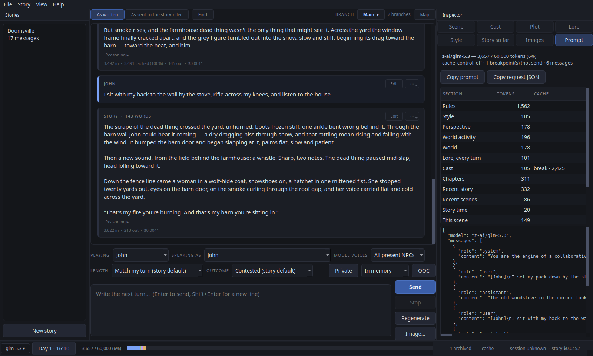
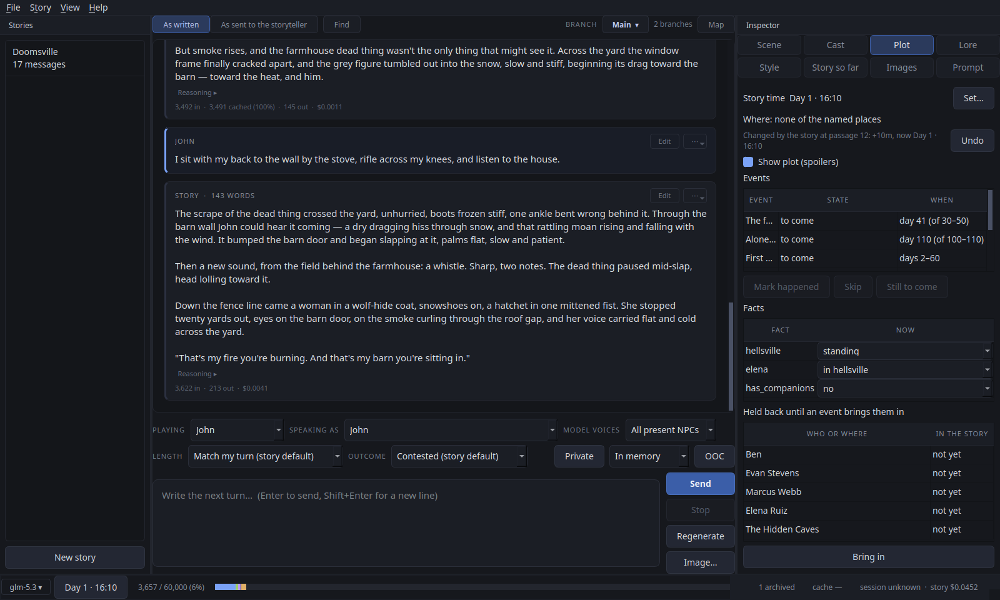
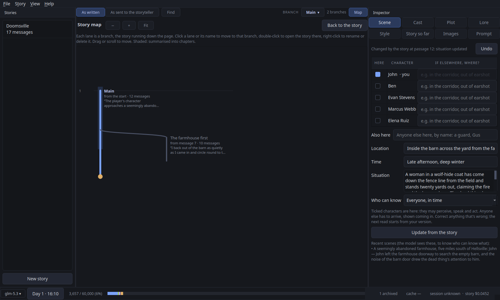
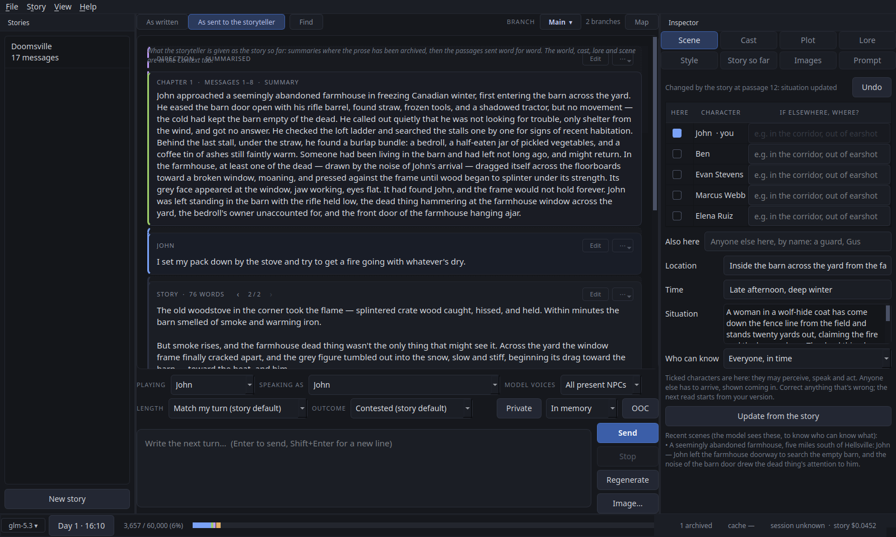

# SealedLore manual

Everything the [README](../README.md) leaves out: installing in detail, every
part of the window, and what each feature does. The README's
[First five minutes](../README.md#first-five-minutes) is the quickest way in.

## Contents

- [Features at a glance](#features-at-a-glance)
- [Installing](#installing)
  - [Linux: the AppImage](#linux-the-appimage)
  - [Linux: from source](#linux-from-source)
  - [Windows (from source)](#windows-from-source)
- [Running the app](#running-the-app)
- [Getting around](#getting-around)
- [Models](#models)
- [Setting up a story](#setting-up-a-story)
- [Drafting a story, and reviewing its settings](#drafting-a-story-and-reviewing-its-settings)
- [Changing the prompts (advanced)](#changing-the-prompts-advanced)
- [Perspective and supporting characters](#perspective-and-supporting-characters)
- [The scene, and who can walk into it](#the-scene-and-who-can-walk-into-it)
- [Branches, takes and export](#branches-takes-and-export)
- [Outcomes and dice](#outcomes-and-dice)
- [Response length and style](#response-length-and-style)
- [Lore retrieval](#lore-retrieval)
- [Pictures](#pictures)
- [Videos](#videos)
- [Private scenes](#private-scenes)
- [Simple chat](#simple-chat)
- [The context budget and archiving](#the-context-budget-and-archiving)
- [The terminal client](#the-terminal-client)
- [Where your data goes](#where-your-data-goes)
  - [On Windows](#on-windows)

## Features at a glance

- **Playing**: you write from inside the story as a character you can switch
  at any time; the model never writes your character, and nobody walks into a
  scene by shortcut. Speaking as a character, as narration or as direction;
  OOC notes; questions to the model out of character.
- **The world and the cast**: world bible, cast sheets with skills, supporting
  characters the story introduces (suggested, never added by themselves), a
  lorebook sent whole when small and selected per turn when large.
- **The scene keeps itself**: after each passage a small model reads who came
  and went, where the scene moved and whether it is private; the Scene tab
  follows, with Undo. Recent scenes and who was in them stay with the story.
- **Simple chat**: a plain conversation with your own system prompt, with
  branches, pictures and summaries, kept on disk or in memory only; a part
  of it can be held in private on another model, and on a TEE model all of
  it is attested (end-to-end encrypted on a `private/` model).
- **Plots**: a Markdown plot file with facts, places and events; a director
  brings events about at the right moment and a clock keeps story time. A
  form-based editor writes the file for you.
- **Outcomes and dice**: fiat, plausible, contested, or d100 rolls against the
  character's skills, per story and per turn.
- **Length and style**: presets with measured word counts, a per-turn
  override that sticks, and a hand-editable style block.
- **Long stories**: archival into chapter summaries written in the background,
  old chapters merged into parts, an optional fact ledger, and the prompt
  laid out for Anthropic prompt caching through OpenRouter or NanoGPT.
- **Takes and branches**: regenerate any passage (the take swaps in place),
  rewrite any earlier message as a named branch, take a turn back into the
  composer; every take is kept.
- **Pictures**: a prompt written from the story on the story's cached prefix,
  approved before anything is sent, with the cast's reference pictures.
- **Videos**: a few seconds of the story, from a prompt written for video,
  optionally starting or ending on a picture; its price shown and accepted
  before it is sent, on a key of its own; played in place.
- **Private scenes**: a span of the story played on a local or TEE model
  alone, end-to-end encrypted on NanoGPT's `private/` models, kept on disk
  or in memory only, handed back as a summary you approve.
- **Drafting and review**: a whole story from a premise; a settings review
  that proposes typed changes you tick.
- **Costs**: per passage, per session and per story, from the endpoint's own
  figures or the model's listed prices.
- **Packaging**: a single-file AppImage; a terminal client for the engine.

## Installing

### Linux: the AppImage

Download `SealedLore-<version>-x86_64.AppImage` from the
[releases page](https://github.com/DigitalArchon/SealedLore/releases), then:

```bash
chmod +x SealedLore-*-x86_64.AppImage
./SealedLore-*-x86_64.AppImage              # the app (takes --mock, --data-dir, --story)
./SealedLore-*-x86_64.AppImage cli list     # the terminal client
```

The AppImage carries its own Python, Qt and the X11 helper libraries that systems often
lack (so no `libxcb-cursor0` install needed). It runs on x86_64 with glibc
2.34 or newer (Ubuntu 22.04, Mint 21, Debian 12, Fedora 35, RHEL 9 and later),
the floor set by PySide6 6.10+. Stories and settings live where they always
do (`$XDG_DATA_HOME/sealedlore`, usually `~/.local/share/sealedlore`), so the
AppImage and an installed copy share them. The sample plot files and their
format guide are inside it (Help → Plot format guide and samples opens them).

If the machine has no FUSE (common in containers, occasionally on minimal
installs), run it with `--appimage-extract-and-run`.

To check a download is what it claims to be, or to build one yourself, see
[Building and checking the AppImage](building.md).

### Linux: from source

Python 3.11 or newer:

```bash
git clone https://github.com/DigitalArchon/SealedLore && cd SealedLore
python3 -m venv .venv
source .venv/bin/activate
pip install -e .
sealedlore-gui
```

To update, run `git pull` and `pip install -e .` again in that folder. Your
stories are kept in the data folder, not here, so updating never touches them.

#### System packages

PySide6's wheels don't bundle `libxcb-cursor`, which Qt 6.5+ requires before
it will load the `xcb` platform plugin. Without it the GUI aborts at startup
with *"Could not load the Qt platform plugin xcb"*. On Debian/Ubuntu/Mint:

```bash
sudo apt-get install -y libxcb-cursor0
```

Wayland sessions don't need it. To check which platform plugin is in play,
run with `QT_QPA_PLATFORM=xcb` or `QT_QPA_PLATFORM=wayland`.

Playing videos uses Qt Multimedia, which needs the PulseAudio client library
(`libpulse0` on Debian/Ubuntu/Mint), present on nearly every desktop. Without
it everything else works, and videos show without a preview and can't be
played in place (their ⋯ menu still opens them in your own player).

#### Desktop entry (optional)

The app sets its Wayland app ID to `sealedlore` (under X11 its `WM_CLASS`
class is `SealedLore`, which the entry's `StartupWMClass` names), but without
a matching desktop entry the desktop environment has no name or icon to
attach to it, and Qt logs `Could not register app ID` at startup.

`Exec` has to be an absolute path unless `sealedlore-gui` is on the session
`PATH` — which it won't be when running from a venv. GIO silently refuses to
load an entry whose `Exec` program it can't find, so install it with the path
substituted (run this with the venv active):

```bash
sed "s|^Exec=.*|Exec=$(command -v sealedlore-gui)|" sealedlore.desktop \
  > ~/.local/share/applications/sealedlore.desktop
mkdir -p ~/.local/share/icons/hicolor/scalable/apps
cp packaging/sealedlore.svg ~/.local/share/icons/hicolor/scalable/apps/sealedlore.svg
update-desktop-database ~/.local/share/applications 2>/dev/null || true
```

### Windows (from source)

SealedLore runs on Windows 10 and 11 (and Windows Server 2022). There is no
installer yet, so you set it up by pasting a few lines into PowerShell, a
window where you type commands. You don't need to know anything about it:
every step below says exactly what to paste. It takes about ten minutes and
needs about 1 GB of disk space.

Linux is the version SealedLore is built and tested on day to day. What is
different about privacy on Windows is under [Where your data goes → On Windows](#on-windows).

#### Opening PowerShell

1. Click the **Start** button, type `powershell`, and click **Windows
   PowerShell**. A window with a blinking cursor opens.
2. To run a line from these instructions: copy it, click in the PowerShell
   window, paste it with **Ctrl+V** (or a right-click), and press **Enter**.
   Wait for the blinking cursor to come back before pasting the next line.

#### Step 1: Install Python and Git

SealedLore needs **Python**, the language it is written in. **Git** is
optional, but it makes updating easier later. There are two ways to get them.

**The quick way (winget).** Windows 11 comes with a tool called `winget`
that installs programs for you, and most up-to-date Windows 10 computers
have it too. Paste these two lines into PowerShell, one at a time:

```powershell
winget install -e --id Python.Python.3.12 --accept-source-agreements --accept-package-agreements
winget install -e --id Git.Git --accept-source-agreements --accept-package-agreements
```

If Windows asks whether to allow the app to make changes, click **Yes**.
When both have finished, **close PowerShell and open it again** (see above),
so it finds what was just installed. Then go to Step 2, "With Git".

If PowerShell says `winget` is not recognised, or either line fails, use the
manual way instead.

**The manual way.** This needs no winget, no Git and no administrator
rights.

1. Go to <https://www.python.org/downloads/release/python-31210/>, scroll
   down to **Files**, and click **Windows installer (64-bit)**.
2. Open the file you downloaded. On the first screen of the installer:
   - **untick** "Use admin privileges when installing py.exe" (so it
     doesn't ask for an administrator's password);
   - leave "Add python.exe to PATH" as it is;
   - click **Install Now**, and **Close** when it says it was successful.
3. Go to <https://github.com/DigitalArchon/SealedLore>, click the green
   **Code** button, and click **Download ZIP**.
4. Open your **Downloads** folder, right-click the ZIP file, choose
   **Extract All**, and click **Extract**.
5. Close PowerShell and open it again (see above). Then go to Step 2,
   "Without Git".

#### Step 2: Install SealedLore

**With Git** (the quick way above). Paste these two lines:

```powershell
git clone https://github.com/DigitalArchon/SealedLore
cd SealedLore
```

**Without Git** (the manual way above). The folder you extracted has
another folder inside it with the same name; open folders until you see one
with files called `README` and `pyproject` in it. Then in PowerShell, type
`cd` and a space (don't press Enter yet), **drag that folder from File
Explorer onto the PowerShell window**, and press **Enter**.

**Then, either way**, paste these two lines. The second one downloads what
SealedLore needs and takes a few minutes; a lot of text scrolls past, and
it is finished when the blinking cursor comes back. A note that "a new
release of pip is available" is harmless.

```powershell
py -3.12 -m venv .venv
.venv\Scripts\python -m pip install -e .
```

#### Step 3: Start it, and make a desktop shortcut

Paste this to start SealedLore:

```powershell
.venv\Scripts\pythonw -m sealedlore.gui.app
```

The SealedLore window opens. To connect it to a model, see step 2 of
[First five minutes](../README.md#first-five-minutes).

To put a **SealedLore** shortcut on your desktop, paste this line (it is
long: copy all of it) while PowerShell is still in the SealedLore folder:

```powershell
$s = (New-Object -ComObject WScript.Shell).CreateShortcut("$([Environment]::GetFolderPath('Desktop'))\SealedLore.lnk"); $s.TargetPath = "$PWD\.venv\Scripts\pythonw.exe"; $s.Arguments = "-m sealedlore.gui.app"; $s.WorkingDirectory = "$PWD"; $s.Save()
```

From then on, double-click the shortcut to start SealedLore. You don't need
PowerShell again until you update.

#### Updating

Your stories are not kept in the SealedLore folder (they are in
`%LOCALAPPDATA%\SealedLore`), so updating never touches them.

- **With Git:** open PowerShell and paste these three lines:

  ```powershell
  cd SealedLore
  git pull
  .venv\Scripts\python -m pip install -e .
  ```

- **Without Git:** download and extract the new ZIP as in the manual way,
  then do Step 2 ("Without Git") and Step 3 again in the new folder,
  including the shortcut line, which replaces the old shortcut. You can
  then delete the old folder.

#### If something goes wrong

- **"py is not recognized"**: close PowerShell and open it again. If it
  still says so, Python isn't installed: follow the manual way in Step 1.
- **"winget is not recognized"**: your Windows doesn't have winget. Use
  the manual way in Step 1.
- **Typing `python` opens the Microsoft Store**: that is Windows offering
  its own Python. Close the Store and use the lines above exactly as
  written: they start with `py` or `.venv\Scripts\python`, which never go
  to the Store. Don't install Python from the Store: that version keeps
  SealedLore's files in a hidden folder of its own, not where Help → About
  SealedLore says they are.
- **The shortcut does nothing**: in PowerShell, go to the SealedLore folder
  (as in Step 2) and paste `.venv\Scripts\python -m sealedlore.gui.app`.
  This is the same as the shortcut, but any error is shown in PowerShell.
  Include it if you report the problem.

#### Removing SealedLore

Delete the SealedLore folder and the desktop shortcut. To delete your
stories and settings too, paste `%LOCALAPPDATA%` into File Explorer's
address bar, press Enter, and delete the **SealedLore** folder there.

For developers: there is no need to activate the venv (PowerShell refuses
`Activate.ps1` by default, and calling `.venv\Scripts\python` avoids it);
`pip install -e ".[dev]"` adds the test tools, and
`.venv\Scripts\sealedlore-gui` starts the app with a console beside it.

## Running the app

```bash
sealedlore-gui            # or: sealedlore-gui --mock  (no endpoint needed)
```

Set the base URL and API key under File → Settings → Endpoint, and the model
under File → Settings → Models. `--data-dir` points at an alternative data
directory, `--story <id>` opens one on start, and `--version` prints the
version (Help → About SealedLore shows it too, with the data folder). Until an endpoint is set, anything that would call a model says so
and does nothing.

**The defaults assume NanoGPT.** The base URL, the lore picker's model
(`deepseek/deepseek-v4.1-flash`), the Jev decision model, the image model
(Seedream), and the `TEE/` and `private/` private models, are NanoGPT's. On OpenRouter or
another endpoint the chat model works as it is; set the lore, scene, plot and
image models to ones your endpoint lists (Browse… shows them), or the calls
that use them fail and fall back where they can.

**Choosing a model.** Every model field has a **Browse…** button. It lists the
models your endpoint offers, fetched from the endpoint itself, and the list is
searchable ("sonnet 4.6", "llama 70b") and sortable by context size or price.
The model name in the status bar does the same for the open story, in one
click. You can still type an id by hand. The image model (Settings → Images,
and the picture dialog) has the same list for image models: search by name,
description or size ("seedream", "4k", "edit"), sortable by price, with how
many reference pictures each takes. The Privacy column says which models are
end-to-end encrypted and which are TEE only. Selecting a TEE model that also
comes end-to-end encrypted offers the encrypted version in one click, and
searching "tee" or "private" lists both. A TEE chat's model button lists only
the models it may move to.

**Managing stories.** Right-click a story in the Stories list:
- **Open folder** shows the story's files in your file manager (also for a
  story that can't be read).
- **Duplicate settings only** makes a new, unplayed story with the same world,
  cast, lore, style and opening.
- **Duplicate entire story** copies everything: every branch, summary and
  question, and its cost history.
- **Delete…** moves it to the desktop's Trash, so it can be restored. The Delete
  key does the same.

In the terminal: `sealedlore duplicate <id> [--settings-only]` and
`sealedlore delete <id>`, which deletes permanently after you confirm.

**File → Close story** (Ctrl+W) goes back to the start page. A chat or a
private scene kept in memory only asks first, because closing it loses it.

Anything that runs as a job of its own shows a progress dialog with a
**Stop** button: a settings review, skill suggestions, a character scan,
archiving, rebuilding summaries.

## Getting around

- **Left dock**: the Stories list (right-click for Open folder, Duplicate and
  Delete).
- **Above the transcript**, a line always says how the open story or chat is
  set up: a story or a simple chat, saved on disk or **in memory only, not
  saved**, its model and how private that is, the endpoint, the route, and a
  private scene when one is open. Hover over it for the whole of it,
  including, for a story, every other call's model and route. It can't be
  changed there; it is only for reference.
- **Above the transcript**, on the right: **Branch** names the branch you are
  reading; its menu switches to another, renames or deletes it, and **Map**
  shows every branch at once.
- **Right dock**, "Inspector", its pages as two rows of buttons: **Scene**
  (who is here and where the story is; a story opens on it, so you can check
  it at a glance), **Cast** (sheets, skills, supporting characters), **Plot** (the clock, facts and events; shown only for a
  story with a plot), **Lore**, **Style**, **Story so far** (the chapter
  summaries: edit, rebuild, archive now; double-click one to go to it in the
  story), **Media** (every picture and video the story has made), and
  **Prompt** (exactly what the storyteller was sent
  last turn; **Copy prompt** copies it as readable text, **Copy request
  JSON** as the exact request body).

  

- **Find** (above the transcript, View → Find in story…, or Ctrl+F) searches
  the branch you are reading, older messages included. It starts at the most
  recent match; **Enter** (or ↑ Earlier) goes back through the story,
  Shift+Enter (↓ Later) forward, and Esc closes it.
- **A long story** shows about a hundred messages at a time around where you
  are reading, so going anywhere in it is quick. Scrolling up or down brings
  in the next part as you reach it; the rows at the top and bottom say how
  many messages lie beyond, with **Start of story** and **Latest** to jump to
  either end. Sending a turn always takes you back to the latest.
- **Above the transcript**: *As written* shows every message; *As sent to
  the storyteller* shows the chapter summaries standing in for archived
  prose and marks anything left out for budget (View → What the storyteller
  is sent, Ctrl+Shift+V).
- **Each message** has Edit and a ⋯ menu: Regenerate this passage, Take back
  this turn (your turns), Reroll the dice, Use as evidence in a review,
  Illustrate this passage…, New branch from here…, and Delete from here….
- **Text size**: View → Text size → Larger (Ctrl++) and Smaller (Ctrl+-)
  change every piece of text in the window, the story, the panels, the menus
  and the map, from 90% to 200%; the same menu lists the sizes, and Normal
  size (Ctrl+0) goes back. It is kept for next time.
- **Theme and fonts**: View → Theme → Dark is the app's own look, and
  View → Theme → High contrast is white on black, every control outlined,
  yellow for focus and what is current. View → Fonts… picks the font for the window, for the
  story (passages, turns and the boxes you write them in) and for the
  monospace Prompt tab; Restore Defaults goes back to the app's own. Both are
  kept for next time.
- **The composer row**: *Playing* is the character you write (the storyteller
  never writes them); *Speaking as* is who your text lands as (that
  character, Narration, Direction, or a Question to the model); *Model
  voices* is who the storyteller may voice this turn.
- **Shortcuts**: Enter sends, Shift+Enter is a new line, Ctrl+Enter sends
  from anywhere, Esc stops, Ctrl+N new story, Ctrl+O import, Ctrl+S save,
  Ctrl+, settings, Ctrl+Shift+I picture, Ctrl+Shift+V the transcript view,
  Ctrl+Q quit.

## Models

Twelve settings name a model; the text models are together on Settings →
Models. Blank ones fall back as shown; the defaults marked ★ are NanoGPT
model ids, so on another endpoint set them to one it lists (Browse…).

| Setting | Where | Used for | Blank means |
|---|---|---|---|
| Story model | Settings → Models | the story model for new stories | starts as `anthropic/claude-sonnet-4.6` |
| This story's model | the status-bar model button | this story's storyteller | Settings → Models → Story model |
| Summarisation model | Settings → Models | chapters, merges, for every story (and the open one, when changed with it open) | the story model |
| Scene model | Settings → Models | the scene read after each passage | the summarisation model |
| Plot model | Settings → Models | the plot's clock, facts and director | the scene model |
| Authoring model | Settings → Models | drafting from a premise, settings reviews | the story model |
| Lore model ★ | Settings → Models | picking lore for a large lorebook | the scene model |
| Image prompt writer | Settings → Models, or the Image dialog | writing the picture's prompt | the story model |
| Jev model ★ | `config.json` only | "Jev before each turn" | — |
| Image model ★ | Settings → Images | pictures | — |
| Private model | Settings → Private | private scenes | — |
| Embeddings model | Settings → Lore | lore vectors | `BAAI/bge-m3` |

A model's reasoning is kept with its passage for you to read, and is never
sent back: no later request, to any model, carries it.

**How much models reason.** Settings → Generation holds the settings for
every story: temperature, max tokens and the rest for the story model, and
how much to ask models to reason, once for the story model's passages and
questions and once for every other call (the scene and plot reads, chapters,
the review, drafts, the picture prompt writer). Both start at **As low as
possible**, which is also the fastest:

- A model that reasons only when asked (Claude, DeepSeek) is asked for
  nothing. Asking such a model for "low" would switch its thinking on.
- A model that reasons at length anyway is caught doing it, and asked for
  its lowest level from then on. When that happens the status bar
  says so, since that first reply may have been slow to start (Kimi K3
  thought for 25 seconds at its own default, and 5 at its lowest), and
  Settings → Generation lists the models caught. The check is repeated a
  week later, in case the model has changed.
- TEE and end-to-end encrypted models start at their lowest level.

**Low**, **Medium**, **High** and **Max** ask for that much, mapped to the
nearest level the model offers; the note under each setting says what the
story model will be sent.

**Recommended models.** Left blank, the scene and plot models fall back to the
story model, the most expensive place to run a small call on every turn. On
NanoGPT a new setup starts with the ones that measured best, and Settings →
Models has **Use recommended models** to fill them in on a setup you already
have (nothing changes until you press Save):

| For | Model | Why |
|---|---|---|
| Scene | `z-ai/glm-5.3` | The read needs a model that reasons; this was the most accurate and the quickest of those that do |
| Plot | `mistralai/mistral-medium-3.1` | The steadiest answers and the shortest wait before a passage. Priced per call, a small fraction of a cent each |
| Lore | `deepseek/deepseek-v4.1-flash` | As before |

They are NanoGPT model ids. On another endpoint the fields stay blank: choose
a model that reasons for the scene and a quick one for the plot (Browse…).

**How fast is each one?** Settings → Models has **Test speed…**. It sends every
model named there, and the private model, one short request, all at the same
time, asking each for the reasoning its setting asks for in play, and shows for
each:

- **First word**: the wait before its answer begins, any reasoning included,
  since that is the wait you sit through.
- **Tokens a second**: how fast the answer itself is then written, from its
  first word to its last. A model that thinks for a long time and then writes
  quickly is slow in the first and fast in this one.
- **In all**: the whole request, start to finish.

The notes say how long the answer took and how long the model reasoned. A
model used for several things is tested once, and an end-to-end encrypted
model's enclave is attested before anything is timed. It uses the fields as
they stand, so you can try a model before saving it. Each test costs a few
hundred tokens (more for a model that reasons). Speeds change with the hour
and the endpoint's load, and one short answer is a small sample: run it a few
times before choosing between models that are close.

**Which host serves a model (routes).** On NanoGPT most open models (GLM,
DeepSeek, Kimi and the like) run on several hosts, and NanoGPT picks one; on
the subscription, usually the cheapest at FP8 precision or better. The model
list's **Hosts** column says how many a model has. For a model with two or
more, **Route…** beside its field (or **Choose a route…** in the model list)
picks for you:

- **Subscription routing**: NanoGPT's own choice, as before.
- **Fastest first word**, **Fastest overall** or **Cheapest**.
- **A specific host**, from a table of each host's precision, privacy terms,
  NanoGPT's measured first token and speed, prices and caching. It is a
  preference: if that host is down, another serves the call.

**FP8 or better**, ticked by default, leaves out hosts running the model at
lower precision, or whose precision isn't listed (they are hidden from the
table while it is ticked).

**Was the route followed?** NanoGPT's replies don't name their host, so each
routed call's bill is the evidence, and the status bar shows it at the
bottom left once a routed call has come back: **⚡ routes** when they were
followed, **⚠ route not followed** when not. Its tooltip gives each route's
roles, model, last call and why. Nothing billed means NanoGPT served the call
on its own subscription routing instead (it does this without a word when a
chosen host is down); a bill at a clearly different price than the chosen
host's means another host served it. **Any route but the
subscription's is billed pay-as-you-go, even for a model the subscription
includes.** The scene read is where a route pays most: on the fastest first
word at FP8 or better it answered in about a third of the time, as
accurately, for a fraction of a cent a read. Without the precision floor it
was slower and less accurate.

Each role has its own route, so a free storyteller and a fast paid scene read
can be the same model. A simple chat's route is chosen with its model in New
simple chat, and belongs to that chat. Routes never apply to `TEE/` or
`private/` models, whose enclave is their host. Test speed… measures each
role on its route, so the same model on two routes shows as two rows. Each
host's privacy terms are its own; on NanoGPT's site your account can require
hosts that keep nothing, which then applies to every route.

## Setting up a story

**Story → Setup…** holds what a story is built on:
- **World**: the setting and its rules, sent with every turn and cached;
- **Style**: length, perspective, person, tense and the rest, the same form as
  the Style page beside the story, so a new story's opening is written the way
  you want it;
- **Opening**: notes the model writes up, or a passage used as written. Write
  it in the person and tense the story is told in: the first passages take
  their voice from it;
- **Starting scene**: where the story begins, who is there, and which
  character to suggest playing. By default the opening decides who is there
  (the people at their posts, whoever the place would have); set someone to
  **Present** or **Not present** to decide it yourself. Anyone not there can
  still come in later.

**Story → Start story…** asks who you're playing and who is there at the start
(the same choice as Setup's, so a new story can have its cast made first), and
runs the opening, so your first turn is in character.

The opening and starting scene are where a story *begins*. To change how a
story already under way began (say, the other character is the one stranded),
edit them in Setup and save: it offers to start a new playthrough from them,
and the story so far is kept as it is.

A **scenario** is that setup, plus the cast and supporting characters, lore,
style, plot, outcome mode, world activity, picture style and reference
pictures, in one file with no playthrough in it:
- **Story → Export → Scenario…** writes the current story's setup to a file;
- **File → Import…** starts a new story from one, opening Setup first so you
  can change anything (the style above all) before its opening is written;
  Start follows once you save, and Cancel keeps it unbegun;
- **Story → Restart as new playthrough…** starts over from the current story's
  setup without a file, opening Setup first in the same way.

From the terminal: `sealedlore scenario export <id> <file>`,
`sealedlore scenario import <file>`, then `/begin <name>` in the chat.

A **plot file** is a scenario written as Markdown, with a plot as well: the
facts the story keeps and the events a director brings about
([`SampleStories/PLOT_FORMAT.md`](../SampleStories/PLOT_FORMAT.md); `Doomsville.md` is a worked example). The Plot page shows the story clock, the facts as they
stand, and, with spoilers on, the events still to come.



**File → Import…** takes a plot file too. The sample stories that come with
SealedLore (every plot file in `SampleStories/` but the format guide) are
listed under **New story from a sample** in the File menu, in the AppImage as
well: File → New story from a sample → Doomsville is the same as importing
`Doomsville.md`. Rather than
write the format by hand, **File → Plot file editor…** writes it for you: the
world, opening, characters, places, lore, facts and events each get a form,
conditions and what an event brings or sets are picked from what the file
already has, and the problems list at the bottom is exactly what the importer
would say, each against the item to fix. Characters, places and lore entries
can be given reference pictures there (**Add…** under Pictures): they are
kept in a `pictures` folder beside the plot file, so share the folder with
the file, and are put on the cards when the file is imported. It needs no story open; the editor's
own **Start a story from this file** (its File menu) saves and imports in one
go.

## Drafting a story, and reviewing its settings

**File → New story from a premise…** Describe the story you want: the setting,
who you'll play, the tone, and choose the **Person** and **Tense** it is told
in (or leave them to the premise), so the opening is written that way. The
model drafts everything in one go:
- the world;
- a small cast with sheets and skills, plus supporting cards (canon characters
  get a one-liner, since the model already knows them);
- lore entries;
- the opening and the starting scene;
- the style.

It opens in Setup for you to read and change, the style included, and Start
asks who you're playing once you save; Cancel keeps the draft without beginning
it (Story → Start story… when it's ready). Anything
the draft got wrong that couldn't be used (a made-up skill tier, a scene naming
someone not in the cast) is listed rather than guessed at.

**Story → Review settings…** Say what isn't working, for example "too much
action, not enough dialogue". The model reviews the story's settings (world,
style, cast and supporting characters, lore, outcome mode, world activity,
the models, the generation settings and the budget) and the instructions the
storyteller actually receives. You choose how many exchanges
from the story it sees as examples, from none to all of them: each is your turn
and the reply to it. By default it sees the last three. The dialog shows about
how many tokens that is, and a review too big for the model is refused before
anything is sent. It then proposes changes one setting at a time, each with
what it replaces and why. You tick the ones to apply; the story so far is never
touched. Anything settings can't fix is listed separately. That includes
requests that would break the two rules SealedLore never bends: the model never
writes your character, and nobody gets into a scene by a shortcut.

It may also propose changes to SealedLore's own texts for this story (see
"Changing the prompts" below): the storyteller's rules, its per-turn
instructions and the final reminder. These are about 5,000 tokens more on
each review. Tick **Let it change the side calls' prompts too** to offer it
the rest (the scene read, the plot, chapters and so on), about 10,000 more.
It may reword the texts that carry the two rules, never weaken them. A
proposal that leaves out a placeholder, or drops much of the text, starts
unticked with a warning.

Tick **Send the whole prompt the storyteller receives** to give the reviewer
everything the storyteller gets on its next turn, not just the system prompt.
That includes the chapter summaries, the recent story, and the per-turn
instructions at the end. What it finds wrong with SealedLore beyond this story
(a default that works against any story, behaviour no text controls) comes
back as **Findings about SealedLore itself**. **Copy
review** puts the whole review, findings included, on the clipboard as
Markdown, ready to report. **Story → Last review…** shows it again, and
**Undo review changes** puts the settings back.

The review also sees the storyteller's model and the Generation settings. It
gets the model's context size, output limit and price from your endpoint, so
it can suggest "temperature 1.8 is why replies wander; try 1.0", or a different
model when the complaint is about what the model can manage. Generation
settings are yours for every story, so those are shown as suggestions with no
box to tick: change them in Settings → Generation if you agree. A suggested model
has to be one your endpoint actually lists. A custom length is always proposed
as its wording, which selects Custom by itself. Changes that a hand-written
style block would ignore aren't offered.

Both work before the first turn, so the quickest way to refine a draft is to
review it: "make the world darker", "add a rival".

Both use the **authoring model** (Settings → Models), which defaults to your
chat model. These are occasional calls the whole story rests on, so a stronger
model can be worth it here, such as Opus 5.5 (`anthropic/claude-opus-5.5`); you can also
change it in each dialog. The story is still played with your chat model. Both
calls count toward the story's cost. The Style tab's **Other notes** field is
where plain-words style requests go ("let the narration show what other
characters are thinking").

In the terminal: `sealedlore generate "<premise>" [--model M]`, and `/review
<complaint>` in the chat, which prints the proposals; apply them in the app.

## Changing the prompts (advanced)

**File → Prompts (advanced)…** shows every instruction SealedLore sends to a
model and lets you change any of them: the storyteller's rules, what it is
told each turn (the scene's roster, the directives, the final REMEMBER line),
and every call made around it (the scene read, the plot's director and clock,
chapters and the ledger, lore choice, private scenes, simple chats, picture
prompts, drafting and the settings review). They are grouped, and the search
finds a text by its name, what it does, or its words.

- **For this story, or for every story.** An edit for one story is kept with
  it (and travels in its scenario file, Restart and Duplicate settings); an
  edit for every story is kept in your settings. A story's own edit wins.
  **Copy from another story…** takes another story's edits.
- **Placeholders** such as `{held}` are filled in by SealedLore: the text
  says what each stands for. Leaving one out is allowed, and the editor says
  what won't reach the model without it.
- **Reset to default** puts one text back, **Reset all…** every text edited
  in the scope you are looking at. The Default tab shows the original.
- When a later version of SealedLore improves a default you have edited, your
  edit stays and is marked ⚠ so you can compare.

This can break a story. The rules stop the storyteller writing your
character, and the reads and the director depend on replies in the shape the
program reads; change those with care, and reset when something goes wrong.
A change to the rules sent at the top of every turn makes the next turn
re-read the whole prompt at full price, once.

## Perspective and supporting characters

**Style → Perspective** chooses how much the model shows. *Follow the whole
story* lets it cut away to other places and people, though nobody elsewhere
can perceive your scene except through a channel the story has set up. *Stay
with my character* shows only what your character perceives.

The **Cast** tab lists your cast and, below it, **supporting** characters: the
people the story introduced, marked ✦ when the model drafted the card. When
turns are archived, or when you press **Scan recent story**, the model suggests
named characters who aren't on file yet:
- **Add** keeps them as supporting characters, shown to the model only when
  they're mentioned;
- **Add to cast** puts them on the roster and in every prompt;
- **Dismiss** stops the name being suggested again.

**Move to cast** and **Move to supporting** switch a character between the two.

Two checkboxes on a cast sheet decide who writes that character:

- **Available to play** on (the default) — you can play them, and the model
  voices them on the turns you don't.
- **Available to play** off — they are the model's: it writes their speech,
  thoughts and choices in full, and they leave the *Speaking as* list. Use this
  when you hand a character over, including one you have been writing yourself:
  the roster tells the model that it now voices them.
- **Never voiced by the storyteller** — yours on every turn, not only while you
  play them. The model is told never to write them.

## The scene, and who can walk into it

The **Scene** tab holds where the story is — location, time, what's going on —
and who is in it. Presence is an arrival rule, not a fence: someone not in the
scene **can** come into it, and the model is told to show them arriving, with a
reason and a way in. What it may not do is have them already be there, overhear
or answer the scene from outside it (no listening in on the comms), or act on
something they had no way of learning.

Afterwards, what happened is part of the world. Public things spread on their
own — a fight in a bar, a ship coming in, a death on the promenade reaches
people who would care, as fast as that world carries news. Private things stay
private until someone tells, someone who was there passes it on, or the
aftermath makes it plain.

**The scene keeps itself.** After each passage a small, cheap model reads what
it changed: who came in and how, who left, whether the scene moved, and
whether it is private. The Scene tab follows, and says what changed — "Changed
by the story at passage 213: +Hollis (came in from the constable's office),
−Ruiz (left for the clinic)" — with an **Undo**. Anything you change yourself
wins, and the next read starts from your version. The roster covers everyone
with a name, not just your cast: your cast first (the one you are playing is
marked "you"), then the supporting characters, each ticked when they are
here, then **Also here** for the story's own people who have no card. The
read gets things wrong at times, which is why the Scene tab is the first
page and the one a story opens on: a glance after each passage shows who the
storyteller thinks is in the room, and a tick fixes it.

The same read catches the shortcuts. If a passage has someone simply already
there, listening in from outside, or acting on something they couldn't know,
the status bar names it once, quoting the sentence, and the sentence stays
with the passage as evidence for a settings review.

Choose the model for this in **Settings → Models → Scene model**; it is one
extra call per passage, on your story model if nothing smaller is set. It is one short call
per passage, so a small fast model is right; blank uses the summarisation
model. Untick **Keep the scene up to date after every passage** to keep the
roster by hand instead, as before.

The scene is saved with each passage, so switching to another take or branch,
taking a turn back, or deleting messages puts the roster back to what it was
at that point.

**Who knows what.** Each scene records who can know what happens in it:
everyone, in time, or only those present. When a scene ends,
where it was, who was there, and what it amounted to go into **Recent scenes**,
which the model sees, so a private conversation stays with the people who were
in the room. Taking up a character who is somewhere else moves the scene to
them rather than pulling them into the current one.

**Update from the story** still reads the recent passages afresh and proposes
all the fields for you to approve, for when the card has drifted.

**Story → Setup… → About → World** sets how much happens that you didn't start:

| | |
|---|---|
| Quiet | the world answers you but rarely intrudes |
| Normal (default) | people pursue their own aims, anyone with a stake acts on it, earlier choices catch up |
| Eventful | most passages bring something: an arrival, news, a complication |

## Branches, takes and export



Every Regenerate keeps the old take: `‹ 2 / 3 ›` on a passage switches
between takes, in place. A take is another version of that one passage, so the
story after it stays where it is, whichever take is showing (if a chapter
summary covers it, the summary is marked out of date). The **⋯** menu on a
message offers **Regenerate this passage** (any passage, not just the latest).

A **branch** is a line of the story you split off on purpose. **Edit** on a
message corrects it in place (a typo, a name); **⋯ → New branch from here…**,
on any message, opens the same editor with a name field beside **Save as a
new branch**: saving starts a new branch from that message, rewritten or as
it is. A turn of yours is answered at once on the new branch; a passage is
your own prose and waits for your next turn. The story as it was is kept,
under its own name: the first line is **Main**, and a new branch is called
what you type, or "Branch 2", "Branch 3"… if you leave the name blank (a name
another branch already has gets a number). Rename any of them later. The **Branch** button above the
transcript always says which branch you are reading, and its menu lists them
all (where each starts and how long it is; hover one for how it begins),
switches between them, and
renames or deletes the one you are on (Main can't be deleted; pictures are
kept). The first message of a branch says "Branch … starts here". Regenerating
never makes a branch.

**Map**, beside the Branch button, shows every branch of the story on one
diagram in place of the transcript, running top to bottom: a lane per branch
down the message numbers, each leaving the lane it split from where it split,
with its name, length and the opening words of the message it began with.
Summarised chapters are shaded, and a dot marks where you are. Hovering shows
a card with the branch, how it begins and ends, and the message under the
pointer; it stays while you read it. Click a lane or its name to move to that
branch (the map stays, with it highlighted); double-click to open the story
there; right-click to rename or delete it. Scroll or drag to move; **−**,
**+** and **Fit** (or the - and + keys, or Ctrl+wheel) zoom along the
timeline. Esc or **Back to the story** returns.

On your own turns the ⋯ menu also offers **Take back this turn**, which
returns the text and its settings to the composer and removes the turn and
everything after it — for when you want to reword what you wrote, or change a
setting, and send it again. Double-clicking a chapter in **Story so far**
jumps to it.

**Story → Export → Story backup…** writes everything (every branch, summaries,
questions, reviews, pictures and the API log) to one file; **File → Import…**
restores it. In the app one import takes every kind of file and does the
right thing with it: a scenario or plot file always becomes a new story ready
to start, and a backup comes back exactly as it was exported, messages and
all. **Story → Export → Markdown (this branch)…** and **Story → Export →
Current chapter as Markdown…** write the prose, without directions, OOC notes
or reasoning. In the terminal: `sealedlore export <id> <file> [--markdown]`,
`sealedlore import <backup>` and `sealedlore scenario import <scenario.json>`
(the terminal keeps the two apart, and has no plot-file import).

**Costs.** Each passage shows its tokens, cache use and cost; the status bar
shows the session and whole-story spend, and **Story → Usage and cost…** breaks
it down. Where the endpoint doesn't report a call's cost (NanoGPT often
doesn't), it's estimated from the model's listed prices and marked `~`.

## Outcomes and dice

**Story → Setup… → About → Outcomes** sets how the result of your character's actions is
decided; **Outcome** in the bottom bar overrides it for one turn.

| Mode | What happens |
|---|---|
| Fiat | What you attempt succeeds exactly as written, with no added catch |
| Plausible | An implausible result may be scaled down, never to failure |
| Contested | The model judges, weighing your character's competence |
| Dice | The app rolls d100; the model narrates the result it's given |

In Dice mode, **Roll** picks which of your character's skills applies and how
hard the attempt is. Skills and tiers (none → legendary) are set in the Cast
tab, or drafted from the character's description with **Suggest skills**. The roll shows in the passage header (🎲 38 / 45 · success);
View → Show dice rolls hides it. Regenerate keeps the roll; **Reroll the dice**
in the passage's ⋯ menu rolls again. Only your character acting is rolled, never Direction or
Narration.

In the terminal: `/mode dice`, `/dice <skill|general> <difficulty>`, `/reroll`.

## Response length and style

The **Style** tab sets the story's default response length and the rest of
the style block (person, tense, prose density, pacing, content limits, phrases
to avoid), with a live preview you can hand-edit. **Person and tense are fixed
once the story has begun**: a switch would leave the story so far in the old
voice, so they are shown greyed for reference, and Story → Restart as new
playthrough… or Duplicate settings tells the story another way. One not set
when the story began can be set once. The rest can change at any time. Person
and tense are also restated on the last line the storyteller reads, which is
what makes it keep them. The **Length** control in
the bottom bar overrides it from here on: your choice stays until you change it
back, and the story's own setting is the first entry, marked *(story default)*.
**Outcome** works the same way. Regenerate uses whatever the two are set to
now, so you can ask for a longer passage and press **Regenerate** to get one.

| Preset | Target |
|---|---|
| Match my turn (default) | scales with what you write; a simple action gets under ~60 words, never more than ~250 |
| Brief | 1–3 sentences, ~20–60 words |
| Standard | about a paragraph, ~60–150 words |
| Descriptive | 2–4 paragraphs, ~150–300 words |
| Literary | several paragraphs, ~300–600 words |
| Custom | your own wording |

Each passage's header shows its word count, so you can see whether a preset
is doing what you want.

In the bottom bar, **Speaking as** chooses where your text lands: a character
(their words and actions), *Narration* (story prose in the fiction, not tied
to anyone), or *Direction* (instructions to the model, outside the fiction).
**OOC** attaches a direction to an otherwise in-character turn. Enter sends;
Shift+Enter starts a new line.

*Question* asks the model something out of character ("why did nobody
react?") and gets a plain answer rather than more story. It appears in the
transcript as a question and is never sent as part of the story.

Every message's ⋯ menu has **Delete from here…**, which removes it and
everything after it, after confirming. Deleting a reply leaves your turn in place, so Regenerate can take
another run at it.

## Lore retrieval

A small lorebook (up to a tenth of the context budget) is sent whole with
every turn, cached, and nothing is selected. Past that size, entries marked
**Always include** stay and the rest are chosen per turn. **Settings → Lore
→ Large lorebooks** picks how: **Model picks after each passage** (default)
has the lore model choose, plus whatever your own turn names; **Jev before
each turn** asks NanoGPT's decision model just before the turn;
**Similarity and keywords** uses embeddings and keywords alone.

Embeddings are off by default. Turn them on under Settings → Lore; leave the
base URL and key blank to reuse the chat endpoint's (the chat key is only
reused for the chat endpoint's own host, never sent to a different server).
The default model is `BAAI/bge-m3` (1024 dimensions, 8k context, no prefixes
needed).

Similarity scores are not comparable between models, so the threshold needs
tuning: the Lore tab shows the score on every hit and on the near-misses that
fell just under it. With embeddings off or the endpoint failing, retrieval
falls back to keyword matching and the status bar says so.

Keywords are matched against your own turn. When your turn names no entry,
the last exchange (your previous turn and the passage that answered it) is
searched too, then the last two, then the last three; the Lore tab says how
far back they reached. Your turn is the better guide: the story's own prose
names its everyday people and places on every turn, and matching it all
brought in far more than the scene needed.

### Lore that hasn't happened yet

The storyteller takes every entry it is sent as already true. An entry about
something still to come (an arrival planned for later, a secret that comes
out near the end, an event you have in mind) tends to happen early. Leave
such things out of the lorebook, write them as the plan they are ("Planned:
…"), or tick **Hold back until I mention it** on the entry. A held-back entry
reaches no model until one of your own turns or Directions names it, by its
title or one of its keywords; from then on it is ordinary lore. The Lore tab
marks it "held back" or "mentioned".

- It is decided per branch: on a branch that starts before your mention, the
  entry is held back again.
- The storyteller naming it doesn't count, and neither does a message in a
  private scene.
- Revealing a small lorebook's entry changes the part of the prompt that is
  cached, so that one turn costs a fresh cache write.
- A story made from a premise may hold back entries of its own, and the
  settings review can suggest holding one back when a passage brings it in
  too early.

## Pictures

**Story → Generate image…** (Ctrl+Shift+I), the **Image…** button beside the
composer, or **Illustrate this passage…** in a passage's ⋯ menu asks the
story's model to write an image prompt from where the story is, choosing
among the reference pictures on cast sheets and lore entries. **Add…** under
the pictures also takes any picture from disk (a place, an object, a pose that
belongs to no card); it is copied into the story, its hidden data removed,
and offered from then on. **Prompt written
by** in the dialog picks another model for that (blank is the story model;
your choice is kept, and is the same setting as Settings → Models → Image
prompt writer). The story model reads the story from its cache; another model
reads it at full price. The dialog shows the
whole request — model, size, count, listed price, the pictures in order, and
the prompt, which you can edit — and nothing is sent until you press
Generate. The picture is drawn in the background while you play on and lands
in the **Media** tab, and can be set as the transcript's background (from
its ⋯ menu, or any picture file with View → Background picture…). Pictures
are kept even when their passage is deleted; only their own Delete removes
them, since they cost money. **Save all…** in the Media tab copies every
picture into a folder you choose; each picture's ⋯ menu saves one.

Pictures go to the chat endpoint unless **Settings → Images** names another:
an address, a key, and the service it is (NanoGPT, OpenRouter, WaveSpeed, or
any OpenAI-compatible `/images/generations`; worked out from the address
unless you choose). Left blank, the address is the chat endpoint's, and its
key is used only when the address is the chat endpoint's own host.

## Videos

**Story → Generate video…**, **Video…** in the Media tab, or **Video of this
passage…** in a passage's ⋯ menu makes a few seconds of video of the story.

**Video costs far more than pictures**: a picture is a few cents, a video tens
of cents to over $10 for a few seconds, and it is charged when it is sent,
even if you stop waiting or delete it afterwards. So:

- **Video is off until it has an API key of its own**, in **Settings →
  Video**. The app never uses the chat key for it. Make a key for video alone
  at the service and set a daily spending limit on it there (on NanoGPT, when
  you create or edit the key): that limit is the one that holds whatever
  happens in the app. When the limit is reached the service refuses, and the
  app says so rather than trying again. You may type your chat or picture key
  in there instead; then every video warns you and asks again before it is
  sent.
- **The dialog says first what this video will cost**, in dollars and in
  pictures' worth, worked out from the model's own price list, and **Generate
  video** stays off until you tick that you accept that price. Changing a
  setting that changes the price clears the tick. When the price can't be
  worked out (some models list theirs in ways that proved wrong, and the app
  won't guess), you tick that you accept an unknown price instead. If the
  service charges more than the dialog showed, the app tells you.

The dialog shows the model's own settings (resolution, length, aspect ratio,
sound and so on, from the service's list; **Browse…** finds another model),
and only values that list offers are sent. **Starts on** and **Ends on** take
any picture of the story: a reference picture from a card, a picture it made,
one from disk, or the last frame of an earlier video, which carries a scene
on. Models that can't take them say so. **Write prompt** asks the prompt
writer (the same one as pictures) for a prompt written for video: one
continuous shot of that length, what moves, what the camera does, and what is
heard if the video has sound, starting from the picture chosen. Change the
length, sound or pictures afterwards and write it again. The prompt is sent
exactly as it stands in the box.

The video is made in the background, which takes a few minutes; its place
after the passage says so, with **Stop waiting**. It is already paid for, so
it is never lost: stopped, or with the app closed, it is fetched when you
press **Check again** or next open the story. (In a chat kept in memory only
it is lost with the chat, and closing the chat says so.) When it arrives,
its hidden data (the encoder's name and settings, creation times) is blanked
without re-encoding, and it shows as its first frame: click to play it in
place, with sound and a position bar. Its ⋯ menu opens it in your default
player, saves it, shows its prompt, makes the next video from its last frame,
or uses that frame as a reference picture. Videos are listed in the Media
tab and saved by **Save all…**. A story backup of a story with videos asks
whether to put them in (they are megabytes each) or leave them out.

The default is Seedance 2.5 at 480p for 5 seconds with sound, on NanoGPT
($0.90 when this was written). **Settings → Video** also takes another
service's address: OpenRouter's video API (`https://openrouter.ai/api/v1`) and
WaveSpeed (`https://api.wavespeed.ai/api/v3`, which quotes each request
itself) are supported.

## Private scenes

The **Private** button beside the composer plays a span of the story on a
separate model that nothing else ever hears about: a local server (Ollama, LM
Studio, llama.cpp), or a NanoGPT `TEE/` model. For a TEE model the app
attests the enclave when the scene begins, before anything is sent:
- the Intel TDX quote, read from its own signed bytes, must bind the enclave's
  signing key to a fresh nonce of ours;
- the quote must verify up to Intel's root, not be revoked or a debug
  enclave, and Intel rates the machine's firmware;
- NVIDIA's signed verdict on the GPUs must be for our nonce and pass.

Providers that run several instances (such as `TEE/kimi-k3`) have every
instance checked the same way. Anything forged, revoked, for another nonce,
or a model that offers no attestation is **refused**, and nothing is sent to
it. What couldn't be checked (no GPU evidence offered, Intel's or NVIDIA's
service out of reach, a rating below up to date) is shown as **partial**,
with the reason on the model button. Each reply's signature record must be
signed by the attested key; the transcript marks such replies "TEE signed",
or "TEE signature unavailable" when the provider signs none. Your own
messages are marked with how they were sent: "sent to the attested TEE", or
"end-to-end encrypted" on a `private/` model.

**Check TEE models** (Settings → Private, on by default) is that whole check
for `TEE/` models. Switched off, a `TEE/` model is used like any other: no
attestation, no signature checks, no marks on the messages, and the model
button says "⚠ not checked" for as long as the scene or chat lasts, so you
can't turn it off and forget. A `private/` model is always attested, whatever
the switch says: its key is what everything is sealed to.

**Test attestation** (beside the model in Settings → Private and New simple
chat, and under the model list when a TEE or encrypted model is selected)
runs that same check before you choose the model. It reports whether the
model attests in full, partially (and why), or is refused, so you know it
works before a scene or chat depends on it. The details are in its tooltip.

What it doesn't prove: which software the enclave runs, or that a reply's
content is what was signed (NanoGPT hashes the request as its gateway
received it, which the app cannot reproduce). And the text still passes
NanoGPT's gateway in the clear; for that, use a `private/` model (below). Everything else the
app does with the story is paused while the scene is open, including the
scene and plot reads, so the scene card and the plot are frozen until it ends.
Ending the scene asks the private model for a summary; you approve, edit or
discard it, and the approved summary is all the story's model will ever know
of the scene. If the summary is stopped or fails, you can ask again, end the
scene without a summary, or keep playing. While a scene is open, Settings,
switching stories or branches, the review and Restart are paused (the app
says so when the scene begins); end the scene to use them again. **In memory** keeps the scene's messages off the disk
altogether (closing the app loses them); **On disk** keeps them as a side
branch no model is sent. A scene that outgrows the private model's context is
condensed by the private model itself, never by the story's. Set the model under Settings → Private, where
**Detect** asks a local server how much context the model is running with. The
endpoint there starts as NanoGPT's, and with its key left blank it uses the
main endpoint's key; only the model is left to choose, and private scenes stay
off until one is.

**End-to-end encrypted models (`private/…`).** NanoGPT's Private Mode
models (`private/glm-5-3`, `private/kimi-k3`, `private/gemma4-31b` and the
rest; Browse… lists them as "end-to-end encrypted") close the gap above: the
prompt is sealed on your machine to a key only the model's enclave holds, and
the reply comes back sealed the same way, so NanoGPT relays ciphertext.
Before anything is sent the app attests the enclave with Tinfoil's own
verifier:
- the hardware's signed report must match the router code Tinfoil
  published, as recorded by Sigstore;
- that report must bind the key the message is sealed to;
- the release must be the latest one on Tinfoil's GitHub, or the model
  button says "⚠ older release".

Replies are marked "end-to-end encrypted", and the attestation is redone
every five minutes. Wherever you choose a model, the model list's Privacy
column and the label beside the model field say which kind a model is: "🔐
End-to-end encrypted", or "TEE" (and, for a TEE model with an encrypted
version, its name).

What NanoGPT still sees: your account, which model, when, how large the
request and reply are, and the usage and cost. NanoGPT reserves a charge for
up to 32,768 output tokens before each reply and refunds the unused part, so
keep some balance in hand. The prompt cache is keyed by a secret the app
makes and seals inside the request, so no one else can probe it (NanoGPT
issues its own secret; the app keeps its own instead).

The app doesn't use NanoGPT's `@nanogpt/private-mode` proxy. That proxy is
run with `npx …@latest`, so NanoGPT could change the code that holds your
plaintext at any time. Instead the app uses Tinfoil's Python library, pinned
by hash like everything else in the AppImage. The AppImage is reproducible,
so you can rebuild a release and compare its checksum. Tinfoil's library
keeps Sigstore's public trust root in `~/.cache/sigstore-python` and
`~/.local/share/sigstore-python`; nothing from your story is kept there.

## Simple chat

**File → New simple chat…** is a plain conversation with a model in
SealedLore's window: your system prompt and your messages, sent exactly as you
write them, with none of the storytelling around them (no rules, cast, lore,
scene, plot or side models). Branches, takes, Edit, Find, pictures and the
cost all work as in a story, and a long chat is summarised in parts as a
story is (Settings → Context), with a plain summariser.
- **Keep in full** (a message's ⋯ menu) sends a message word for word even
  once its part of the chat is summarised: it rides after that part's
  summary. Your first message starts kept. Story so far says when kept
  messages take more than a fifth of the budget.
- The system prompt is set when you start the chat and under **Story →
  Setup…** afterwards; a change costs one cache miss. Beside it, the **Tail**
  (also set at the start) is fixed text sent after your message at the end
  of every request (a style reminder, a standing rule). It is never saved
  into the conversation.
- **A part of a chat can be held in private**, as a scene of a story can
  (see "Private scenes"). The **Private** button beside the message box sends
  what you write next to your private model (Settings → Private) and to
  nothing else; the chat's own model sees none of it. Beside it you choose
  whether that part is kept **In memory** (gone when the app closes) or **On
  disk**; a chat kept in memory only keeps its private parts in memory too,
  so it doesn't ask. **End private** has the private model write a summary for you to
  approve, change, or do without; what you approve joins the chat, marked as
  a summary of a private part, and is all the chat's model ever reads of it.
  While a part is open, Settings and switching to another chat or story are
  paused. A chat on a TEE model has no Private button: all of it is private
  already.
- **On a NanoGPT `TEE/` model** the chat is private as a private scene is:
  the enclave is attested when the chat opens (unless Check TEE models is off
  under Settings → Private, which the model button then says), each reply is
  checked to be signed by it ("TEE signed"), every call (summaries and
  picture prompts included) goes to that model, and the chat can move only
  to another TEE model. The text still passes NanoGPT's gateway, as a
  private scene's does, unless the model is a `private/` one: then it is
  end-to-end encrypted (see "Private scenes"), and the chat can move only to
  another `private/` model.
- **Where a chat is kept** is asked when it starts, on any model: **On
  disk**, like any story, or **In memory only**. Nothing of an in-memory
  chat is written on this computer, not even its log, and it teaches the
  settings nothing (changing its model doesn't change your default). It
  isn't in the Stories list, and closing it asks first, since it is then
  gone. Its pictures are kept in memory with it (reference pictures and the
  background too). To keep anything, write it out first: **Story → Export →
  Story backup…** (the whole chat, its pictures and costs), Markdown, or
  **Media → Save all…** for the pictures and videos. File → Import… of such a backup
  asks whether to open it in memory again, writing nothing, or save it as an
  ordinary chat. In memory only is about your computer, not the model: on an
  ordinary model the provider still receives every message (on NanoGPT, your
  account's data retention setting applies there).

## The context budget and archiving



The **Context budget** (File → Settings → Context, with a story open) is how
many tokens the storyteller's whole prompt may use each turn: the rules,
world, cast and chapter summaries as well as the recent story word for word. When a prompt reaches it, the oldest whole chunk of
the story — ten exchanges by default — is summarised into a chapter, and the
chapter stands in for that prose from then on.

Archiving doesn't stop the moment the story fits again. It keeps taking whole
chapters until the prompt is down to **Archive down to**, 50% of the budget by
default, and then leaves the story alone until the budget is reached again.
Stopping at the budget line left only a few hundred tokens of headroom, so the
next few turns crossed it again and each of those paid for another summary and
another full re-send of the cached prompt. On a 216-turn test story at a 35,000
budget, stopping at the line bought 6 quiet turns; going down to half buys 31.
The same prose is summarised either way — just in fewer, larger runs.

An archival run summarises several chapters in a row, and the status bar names
each one as it lands. If the budget is too small to hold the story even fully
archived, it says that instead of spending every turn trying: a long story's
fixed parts — the rules, world, cast and the chapter summaries themselves — can
be several thousand tokens before a word of recent prose is added.

## The terminal client

A terminal client for the engine: the same stories, without the window.
`--mock` needs no endpoint or API key:

```bash
sealedlore new "The Sundering" --model anthropic/claude-sonnet-4.5
sealedlore list
sealedlore chat <story-id> --mock
```

Inside the chat REPL, `/help` lists every command: among them `/hold` (play
a character), `/present`, `/scene`, `/where`, `/privacy` (who can know what
happens here), `/speaker`, `/ooc`, `/mode`, `/dice`, `/len`, `/style`,
`/regen`, `/undo`, `/ask`, `/review`, `/inspect`, `/budget`, `/summaries`,
`/archive`, `/lore`. The length presets are named as in the app, with
`adaptive` for "Match my turn". To talk to a real endpoint:

```bash
sealedlore configure --api-key <key> --model anthropic/claude-sonnet-4.5
sealedlore chat <story-id>
```

## Where your data goes

Nothing leaves your machine except what the features below send, and every
endpoint must be `https://` (plain `http://` is accepted only for
`localhost`). There is no telemetry, no update check and no crash reporting.

- **The chat endpoint** (Settings → Endpoint) gets every prompt: the world,
  cast, lore, the recent story and your turn; the chapter summaries, scene
  and plot reads, character scans, settings reviews and image prompts made
  from the story; and a request for its model list when a price or the model
  picker needs one.
- **The embeddings endpoint** (Settings → Lore, off by default) gets the lore
  entries and a query built from the last few passages. Its key is only
  filled in from the chat key when it is the same host. A large lorebook's
  picks also go to the chat endpoint (the lore model), or, with "Jev before
  each turn", to its `/decisions` route with the lore and recent story.
- **The image endpoint** (Settings → Images; by default the chat
  endpoint's host) gets the approved prompt and the reference pictures you
  chose, and the picture comes back and is saved with the story (a reply that
  names a download link is fetched from that link, which may be a content
  network, without the key). WaveSpeed takes pictures as links, so the
  reference pictures are uploaded to it first. In a private scene the prompt
  is written by the private model but still sent there, with a warning in
  the dialog.
- **The video endpoint** (Settings → Video, off until it has a key) gets the
  approved prompt and the start and end pictures you chose (uploaded first
  to WaveSpeed), then is asked after the video until it is done; the video is
  fetched from the link it gives (NanoGPT's is a content network, fetched
  without the key) and saved with the story.
- **A private scene** goes to the private endpoint alone (Settings →
  Private): a local server, or a NanoGPT `TEE/` or `private/` model. Verifying
  a TEE model sends the enclave's GPU evidence, and nothing else, to NVIDIA's
  attestation service, and fetches Intel's public certificates, revocation
  lists and platform ratings (`api.trustedservices.intel.com`,
  `certificates.trustedservices.intel.com`) to check the enclave's quote. A `private/` model's attestation is fetched through
  NanoGPT and checked against Sigstore's public records and Tinfoil's latest
  release on GitHub; what the app sends it is sealed first (see "Private
  scenes"). Everything else the app does with the story is paused until the
  scene ends, and only the summary you approve goes back into it. "In
  memory" keeps the scene's messages off the disk; its calls are logged
  without content, so the cost still adds up.
- **On first run from a source or pip install**, `tiktoken` downloads its
  token vocabulary from OpenAI's public file store; the AppImage bundles it.
  No data about you is sent.

On disk: settings, including the API key in plain text, are in
`config.json` in the data folder (Help → About SealedLore shows where). The
folder and everything the app writes in it are readable by your user only.
Each story keeps every request and reply in its `api_log.jsonl`, so a story
backup (Story → Export → Story backup…) carries every prompt sent for it; a
scenario export carries only the setup. If the app ever crashes outright,
`crash.log` in the same folder gets the program's stack at that moment (file
and function names, nothing from your stories); it stays on your machine,
for you to send along with a bug report if you choose. The app also tells
the system not to keep a core dump of it (a copy of its memory), so a crash
never writes a memory-only chat or scene anywhere. Swap and hibernation are
the system's own and outside the app's reach: the system may write the app's
memory there, a memory-only chat or scene included. An encrypted disk, or
encrypted swap, covers them. On Linux you can also turn swap off while you
use the app (`sudo swapoff -a`, then `sudo swapon -a` afterwards); turning it
off moves what is already in swap back into memory, so it needs enough free
RAM. The app can't lock its own memory against swapping instead: an ordinary
user may lock only a few megabytes (`ulimit -l`), far less than it uses.

### On Windows

Everything sent over the network is the same on Windows: HTTPS only, the TEE
checks, and the sealing of end-to-end encrypted models. What differs is
what the app can promise on the machine itself.

- **The data folder is yours alone.** `chmod` means nothing on Windows, so
  the app gives the folder its own permissions instead: your account and
  SYSTEM, nobody else, carried down to every file in it. Administrators can
  still take ownership of it, as root can read anything on Linux.
- **A crash can leave a copy of the app's memory.** Linux can be told to
  keep no core dump; Windows can't, reliably. After a crash, Windows Error
  Reporting may save a dump, or send one to Microsoft, and it can hold part
  of a memory-only chat or scene. The app turns off the crash dialog, but
  not the report. To stop it, turn Windows Error Reporting off (or set
  `HKEY_CURRENT_USER\Software\Microsoft\Windows\Windows Error Reporting`
  `Disabled` to 1). The app won't change the registry for you.
- **Other programs you run can read the app's memory.** On Linux the app
  blocks this; Windows has nothing equivalent.
- **Memory can reach the disk**, as swap can on Linux. Windows writes memory
  to `pagefile.sys` and `hiberfil.sys`, which are unencrypted without BitLocker or Device
  Encryption. With Device Encryption on, its recovery key is usually stored
  in your Microsoft account.
- **Screen capture: private windows are left out.** While a private scene or
  a TEE or end-to-end encrypted chat is open, the window is kept out of
  screen capture. That covers Recall on Copilot+ PCs, screenshots, screen
  recordings and remote-desktop viewers: they show whatever is behind the
  window, as if it weren't there, and so will your own screenshots. The
  private summary dialog, and the picture dialog during a scene, are kept
  out too. This needs Windows 10 version 2004 or later.
- **Copying: some copies stay out of clipboard history.** Copy prompt and
  Copy review mark what they copy to be left out of clipboard history
  (Win+V) and the cloud clipboard. Text you select and copy with Ctrl+C is
  not marked, so turn off clipboard history if that matters.
- **OneDrive may upload exports.** Documents and Desktop are often synced
  to OneDrive. A story backup holds every prompt sent for the story, so
  save it somewhere that isn't synced if that matters.
